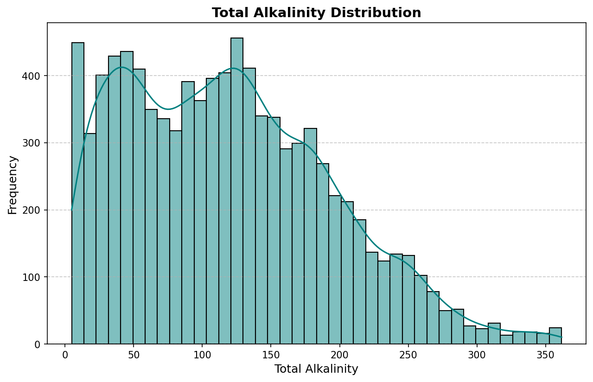
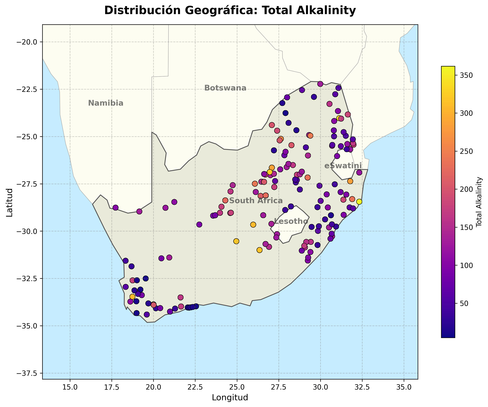
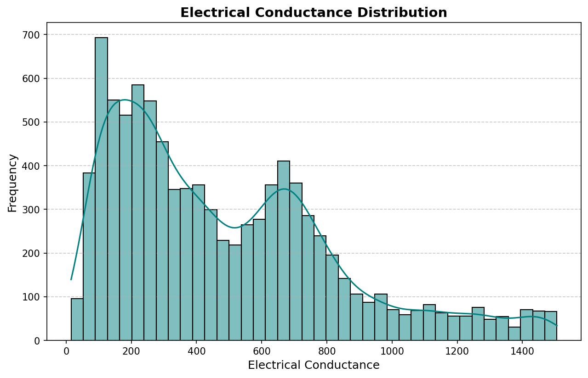
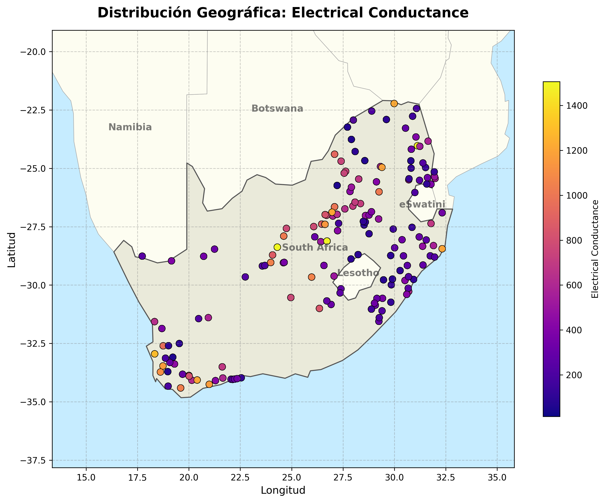
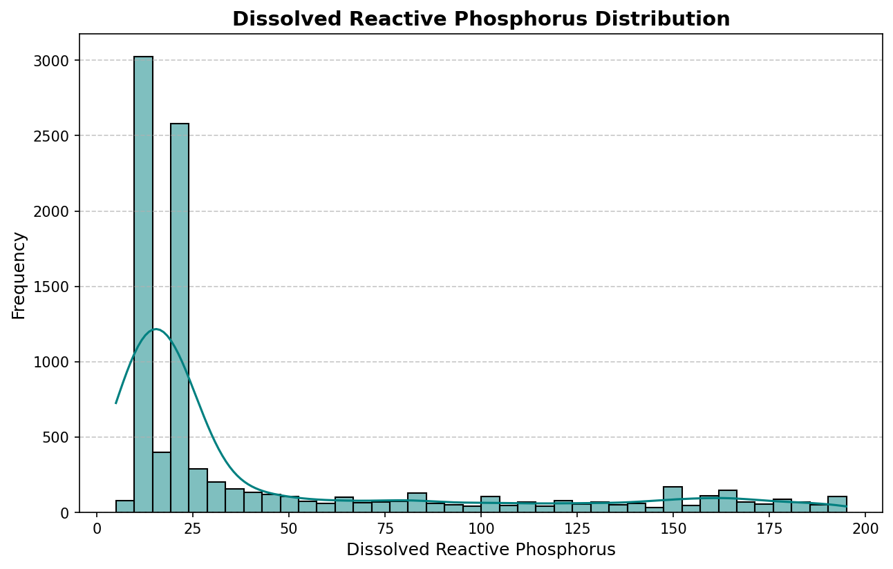
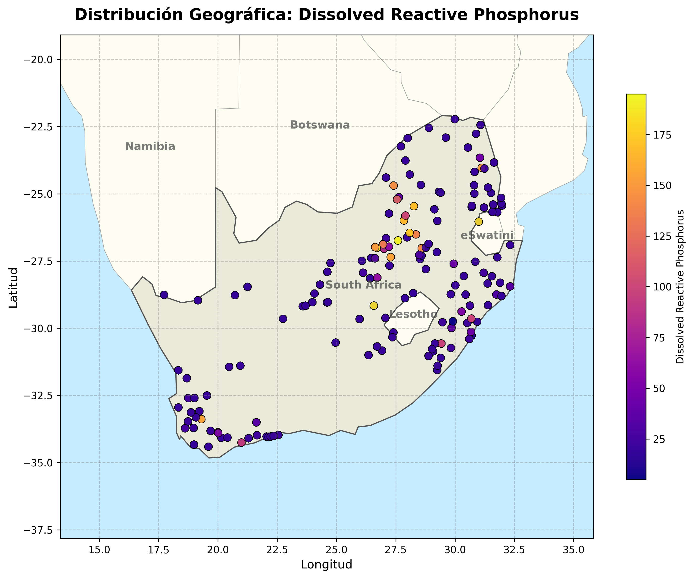

## Introducción

El hackaton “2026 Optimizing Clean Water Supply”,
organizado en el marco de las competencias de ciencia de datos de DrivenData,
consistió en el desarrollo de modelos predictivos para estimar variables 
clave de la calidad del agua.

La competencia se basó en el uso de datos reales 
provenientes de sistemas de monitoreo hidrológico, 
incluyendo mediciones ambientales y registros históricos.
A partir de estos datos, los participantes aplicaron técnicas 
de aprendizaje automático para identificar relaciones entre variables 
y generar predicciones.

El problema central consiste en predecir tres variables de calidad
del agua en cuerpos de agua superficiales de Sudafrica a partir de
datos de teledetección 
satelital y datos climáticos. Las tres variables objetivo son:

| Variable | Unidad | Naturaleza estadística |
|---|---|---|
| Total Alkalinity (Alcalinidad Total) | mg/L CaCO₃ | Distribución aproximadamente normal, valores moderadamente altos |
| Electrical Conductance (Conductancia Eléctrica) | µS/cm | Alta varianza, sesgada hacia la derecha |
| Dissolved Reactive Phosphorus (DRP) | µg/L | Fuertemente sesgada a la derecha, con muchos valores cercanos a cero y outliers extremos |


### Total Alkalinity




### Electrical Conductance




### Dissolved Reactive Phosphorus (DRP)




##  Fuentes de datos

Para este hackaton se nos fue proporcionado tres datasets:

1. **`water_quality_training_dataset.csv`**: Contiene las mediciones de
los tres parámetros de calidad. 
Incluye columnas de `Latitude`, `Longitude` y `Sample Date` como llaves de union.
Cada fila representa una muestra de agua tomada en un punto geográfico específico
en una fecha determinada.

2. **`landsat_features_training.csv`**: Contiene los valores de reflectancia de superficie
de las bandas Landsat 8/9, extraídas en los mismos puntos y fechas que las muestras de campo.
Las bandas fueron:
   - `nir`: Infrarrojo cercano (~865 nm), altamente sensible a la biomasa y turbidez [^1]
   - `green`: Verde (~560 nm), sensible a la clorofila [^2]
   - `swir16`: Infrarrojo de onda corta 1 (~1610 nm), sensible a la humedad del suelo y turbidez
   - `swir22`: Infrarrojo de onda corta 2 (~2200 nm), partículas suspendidas en agua
   - `NDMI`: Índice de Diferencia Normalizada de Humedad, calculado como `(NIR - SWIR16) / (NIR + SWIR16)`
   - `MNDWI`: Índice de Agua de Diferencia Normalizada Modificado, calculado como `(Green - SWIR16) / (Green + SWIR16)`

3. **`terraclimate_features_training.csv`**: Contiene variables climáticas del modelo TerraClimate,
incluyendo:
   - `pet`: Evapotranspiración potencial (mm/mes), indicador de condiciones hidrológicas y aridez local [^3]

### El Modelo del Benchmark

El notebook de referencia (`Benchmark_Model_Notebook.ipynb`)
proporcionado por los organizadores de la competencia, para mostrar
un ejemplo de como hacer el ejercicio implementaba lo siguiente:

- Carga y cruce de los tres datasets por coordenadas y fecha, luego llena los valores faltantes con la media
- Sin escalado de características
- Modelo único por variable objetivo: `HistGradientBoostingRegressor` con parámetros por defecto
- Sin ingeniería de características adicional más allá de las bandas espectrales y el `pet`

**Resultado del benchmark original:** R² promedio ≈ **0.52**.

```py
# Suppress warnings
import warnings
warnings.filterwarnings('ignore')

# Visualization libraries
import matplotlib.pyplot as plt
import seaborn as sns

# Data manipulation and analysis
import numpy as np
import pandas as pd

# Multi-dimensional arrays and datasets (e.g., NetCDF, Zarr)
import xarray as xr

# Geospatial raster data handling with CRS support
import rioxarray as rxr

# Raster operations and spatial windowing
import rasterio
from rasterio.windows import Window

# Feature preprocessing and data splitting
from sklearn.preprocessing import StandardScaler
from sklearn.model_selection import train_test_split
from scipy.spatial import cKDTree

# Machine Learning
from sklearn.ensemble import RandomForestRegressor
from sklearn.metrics import r2_score
from sklearn.metrics import mean_squared_error

# Planetary Computer tools for STAC API access and authentication
import pystac_client
import planetary_computer as pc
from odc.stac import stac_load
from pystac.extensions.eo import EOExtension as eo

from datetime import date
from tqdm import tqdm
import os 

Water_Quality_df=pd.read_csv('water_quality_training_dataset.csv')
landsat_train_features = pd.read_csv('landsat_features_training.csv')
Terraclimate_df = pd.read_csv('terraclimate_features_training.csv')

wq_data = combine_two_datasets(Water_Quality_df, landsat_train_features, Terraclimate_df)
wq_data = wq_data.fillna(wq_data.median(numeric_only=True))

wq_data = wq_data[['swir22','NDMI','MNDWI','pet', 'Total Alkalinity', 'Electrical Conductance', 'Dissolved Reactive Phosphorus']]

def split_data(X, y, test_size=0.3, random_state=42):
    return train_test_split(X, y, test_size=test_size, random_state=random_state)

def scale_data(X_train, X_test):
    scaler = StandardScaler()
    X_train_scaled = scaler.fit_transform(X_train)
    X_test_scaled = scaler.transform(X_test)
    return X_train_scaled, X_test_scaled, scaler

def train_model(X_train_scaled, y_train):
    model = RandomForestRegressor(n_estimators=100, random_state=42)
    model.fit(X_train_scaled, y_train)
    return model

def evaluate_model(model, X_scaled, y_true, dataset_name="Test"):
    y_pred = model.predict(X_scaled)
    r2 = r2_score(y_true, y_pred)
    rmse = np.sqrt(mean_squared_error(y_true, y_pred))
    print(f"\n{dataset_name} Evaluation:")
    print(f"R²: {r2:.3f}")
    print(f"RMSE: {rmse:.3f}")
    return y_pred, r2, rmse

def run_pipeline(X, y, param_name="Parameter"):
    print(f"\n{'='*60}")
    print(f"Training Model for {param_name}")
    print(f"{'='*60}")
    
    X_train, X_test, y_train, y_test = split_data(X, y)
    
    X_train_scaled, X_test_scaled, scaler = scale_data(X_train, X_test)
    
    model = train_model(X_train_scaled, y_train)
    
    y_train_pred, r2_train, rmse_train = evaluate_model(model, X_train_scaled, y_train, "Train")
    
    y_test_pred, r2_test, rmse_test = evaluate_model(model, X_test_scaled, y_test, "Test")
    
    results = {
        "Parameter": param_name,
        "R2_Train": r2_train,
        "RMSE_Train": rmse_train,
        "R2_Test": r2_test,
        "RMSE_Test": rmse_test
    }
    return model, scaler, pd.DataFrame([results])

  X = wq_data.drop(columns=['Total Alkalinity', 'Electrical Conductance', 'Dissolved Reactive Phosphorus'])

y_TA = wq_data['Total Alkalinity']
y_EC = wq_data['Electrical Conductance']
y_DRP = wq_data['Dissolved Reactive Phosphorus']

model_TA, scaler_TA, results_TA = run_pipeline(X, y_TA, "Total Alkalinity")
model_EC, scaler_EC, results_EC = run_pipeline(X, y_EC, "Electrical Conductance")
model_DRP, scaler_DRP, results_DRP = run_pipeline(X, y_DRP, "Dissolved Reactive Phosphorus")
```

Con los resultados:

```txt
============================================================
Training Model for Total Alkalinity
============================================================

Train Evaluation:
R²: 0.903
RMSE: 23.132

Test Evaluation:
R²: 0.546
RMSE: 50.870

============================================================
Training Model for Electrical Conductance
============================================================

Train Evaluation:
R²: 0.918
RMSE: 98.007

Test Evaluation:
R²: 0.585
RMSE: 219.999

============================================================
Training Model for Dissolved Reactive Phosphorus
============================================================

Train Evaluation:
R²: 0.882
RMSE: 17.455

Test Evaluation:
R²: 0.529
RMSE: 35.182
```

----
## Preprocesamiento de Datos

Para comenzar a hacer mis modelos se trabajó primero en tener un buen dataset,
para esto, los tres archivos CSV se cargan y fusionan mediante un `inner join`
usando como claves las columnas `Latitude`, `Longitude` y `Sample Date`. 
Este tipo de unión garantiza que las muestras se unan en los mismos datos

```python
merged_df = pd.merge(wq_df, landsat_df, on=['Latitude', 'Longitude', 'Sample Date'], how='inner')
merged_df = pd.merge(merged_df, terraclimate_df, on=['Latitude', 'Longitude', 'Sample Date'], how='inner')
```


Como parte del preprocesamiento se eliminan las filas donde las variables objetivo/dependientes tienen valores nulos:

```python
targets = ['Total Alkalinity', 'Electrical Conductance', 'Dissolved Reactive Phosphorus']
merged_df = merged_df.dropna(subset=targets)
```

No tiene sentido entrenar sobre ejemplos donde el valor a predecir es desconocido.
Pues puede crear predicciones erroneas en el modelo

### Imputación de features

El modelo original del benchmark usaba imputación con la **media aritmética**.

```python
val_data = val_data.fillna(val_data.median(numeric_only=True))
```

En lugar de eso se decidio escoger la mediana, esto por que
la media es muy sensible a los outliers [^4]

```py
feature_cols = ['nir', 'green', 'swir16', 'swir22', 'NDMI', 'MNDWI', 'pet']
for col in feature_cols:
    merged_df[col] = merged_df[col].fillna(merged_df[col].median())
```

Esto significa que la mediana no cambia significativamente aunque se
agreguen valores extremadamente grandes o pequeños


Se agregó un escalado en este entrenamiento.

```python
scaler = StandardScaler()
X_train_scaled = scaler.fit_transform(X_train)
X_val_scaled = scaler.transform(X_test)  # transform únicamente, sin fit
```

El `StandardScaler` transforma cada feature: `X_scaled = (X - μ) / σ`,
donde μ es la media y σ la desviación estándar del conjunto de entrenamiento. Esto es necesario por que la latitud varía en ~10 grados, las bandas `nir`/`green`
varían entre 0 y 0.5, y los ratios espectrales tienen valores superiores a 200. Los algoritmos con regularización le dan más peso a las variables 
de mayor escala numérica y en el `StackingRegressor`, el `Ridge` recibe como input las predicciones 
de 5 modelos base. Si esas predicciones tienen escalas muy diferentes (porque los targets tienen órdenes de magnitud distintos), la Ridge
tiene dificultades para encontrar una combinación lineal óptima.

El scaler se ajusta únicamente sobre el conjunto de entrenamiento (`fit_transform`) y se aplica (sin reajustar) sobre validación y test (`transform`).
Si el scaler viera los datos de validación durante `fit`, la media y σ que calcularía incorporarían información "del futuro",
haciendo que los resultados de validación sean artificialmente optimistas y no representativos del rendimiento real en producción.
El scaler se guarda como `scaler.pkl` para garantizar la misma transformación en inferencia.

---

## Ingeniería de Características

La ingeniería de características fue el componente con mayor impacto individual en el rendimiento del modelo.
Partiendo solo de las 7 features del benchmark (4 bandas Landsat + NDMI + MNDWI + pet),
se llegó a un total de 30 features.

Para empezar a los valores del tiempo se les aplico una "codificacion ciclica"

```python
merged_df['Month'] = merged_df['Sample Date'].dt.month
merged_df['DayOfYear'] = merged_df['Sample Date'].dt.dayofyear
```

```python
merged_df['sin_doy'] = np.sin(2 * np.pi * merged_df['DayOfYear'] / 365)
merged_df['cos_doy'] = np.cos(2 * np.pi * merged_df['DayOfYear'] / 365)
```

Esto por que si se usa `DayOfYear` directamente como feature numérica,
sucede un efecto ya conocido en el machine learning en el que el modelo 
aprende que el día 1 (1 de enero) y el día 365 (31 de diciembre)
están a una "distancia" de 364 días, cuando en realidad están 
a un solo día de diferencia.
Los árboles de decisión no tienen este problema por naturaleza,
pero la codificación cíclica facilita que el modelo encuentre patrones 
periódicos más fácilmente. [^5]

Las funciones `sin` y `cos` del día del año crean un espacio bidimensional
donde puntos cercanos en el tiempo circular están también cercanos en el espacio de features:
el 31 de diciembre y el 1 de enero quedan a distancia pequeña en `(sin_doy, cos_doy)`.

---- 

Luego se aplicaron caracteristicas de ubicacion geografica

```python
from sklearn.cluster import KMeans
coords = merged_df[['Latitude', 'Longitude']]
kmeans = KMeans(n_clusters=10, random_state=42, n_init=10)
merged_df['Cluster'] = kmeans.fit_predict(coords)
```

El K-Means con 10 clusters divide el territorio geográfico en 10 regiones.
Y luego se le asigna la etiqueta del cluster (`Cluster` = 0 a 9) permite al modelo aprender
efectos regionales.

Se escogieron 10 clusters por que considero que tiene la granularidad suficiente para capturar variación 
regional sin introducir overfitting

Cuando se introdujo la caracteristica de Cluster el modelo mejoró el DRP de 0.6964 a 0.7077.

Tambien se agregaron interacciones entre la banda y la geografia:
```python
merged_df['nir_lat'] = merged_df['nir'] * merged_df['Latitude']
merged_df['green_lat'] = merged_df['green'] * merged_df['Latitude']
merged_df['swir16_lat'] = merged_df['swir16'] * merged_df['Latitude']
```

la interacción banda × latitud permite al modelo capturar variaciones
espaciales en la relación entre reflectancia y la variable objetivo.

Estos términos permiten modelar efectos donde la influencia de una variable
depende de otra, lo cual no puede representarse mediante modelos puramente aditivos. [^6]


Las distribuciones de las bandas espectrales son asimétricas.
La transformación `log1p(x) = log(1 + x)` comprime los valores extremos y expande los valores pequeños,
haciendo la distribución más simétrica.

```python
for col in ['green', 'nir', 'swir16']:
    merged_df[f'log_{col}'] = np.log1p(merged_df[col])
```


Se usa `log1p` en lugar de `log` para manejar valores igual a cero sin producir `-inf`.

Tambien se uso las relaciones entre diferentes bandas:

```python
merged_df['nir_green_ratio']       = merged_df['nir']    / (merged_df['green']  + 1e-6)
merged_df['swir16_swir22_ratio']   = merged_df['swir16'] / (merged_df['swir22'] + 1e-6)
merged_df['green_swir16_ratio']    = merged_df['green']  / (merged_df['swir16'] + 1e-6)
merged_df['green_nir_ratio']       = merged_df['green']  / (merged_df['nir']    + 1e-6)
merged_df['swir16_nir_ratio']      = merged_df['swir16'] / (merged_df['nir']    + 1e-6)
```

Los ratios de bandas son indicadores espectrales ampliamente usados en
teledetección de calidad del agua.
Son invariantes ante cambios de iluminación (ángulo solar, condiciones atmosféricas)
porque afectan a numerador y denominador por igual, cancelándose.
Se usa `+1e-6` en el denominador para evitar divisiones por cero sin alterar
significativamente el resultado.


| Ratio | Interpretación física |
|---|---|
| `nir_green_ratio` | Proxy de clorofila y biomasa fitoplanctónica [^7] |
| `swir16_swir22_ratio` | Sensible a partículas en suspensión y turbidez [^8] |
| `green_swir16_ratio` | Proxy del MNDWI; discrimina agua de suelo  [^9]|
| `green_nir_ratio` | Variante del NDVI inverso; sensible a agua clara |
| `swir16_nir_ratio` | Índice de sedimentos en suspensión  [^10] |


Se agregaron las siguientes features polinomicas:

```python
# Cuadráticas (captura relaciones no lineales)
merged_df['nir_sq']    = merged_df['nir']    ** 2
merged_df['green_sq']  = merged_df['green']  ** 2
merged_df['swir16_sq'] = merged_df['swir16'] ** 2

# Interacciones (captura efectos conjuntos entre bandas)
merged_df['nir_green_inter']  = merged_df['nir']  * merged_df['green']
merged_df['nir_swir16_inter'] = merged_df['nir']  * merged_df['swir16']
```

Esto por que los modelos de árbol pueden aproximar términos polinómicos a través de splits sucesivos,
pero agregar explícitamente las features cuadráticas les permite descubrir esas relaciones [16]
con menos splits y de forma más eficiente (menor profundidad requerida, menos riesgo de overfitting).

Las **interacciones** capturan efectos sinérgicos: la relación entre `nir` y `green` juntos puede 
predecir la clorofila mejor que cada banda por separado, porque la clorofila absorbe fuertemente
en rojo pero no en verde ni en NIR. [^11]


| Categoría | Features | Cantidad |
|---|---|---|
| Bandas espectrales originales | nir, green, swir16, swir22, NDMI, MNDWI | 6 |
| Climática | pet | 1 |
| Espaciales | Latitude, Longitude, Cluster | 3 |
| Temporales | Month, DayOfYear, sin_doy, cos_doy | 4 |
| Log-transformadas | log_nir, log_green, log_swir16 | 3 |
| Ratios espectrales | 5 ratios | 5 |
| Polinómicas (cuadráticas) | nir_sq, green_sq, swir16_sq | 3 |
| Interacciones espectrales | nir_green_inter, nir_swir16_inter | 2 |
| Interacciones espaciales-espectrales | nir_lat, green_lat, swir16_lat | 3 |
| **Total** | | **30** |

---

## Evolución de la Arquitectura del Modelo

### El Modelo del benchmark

El benchmark usaba un único `HistGradientBoostingRegressor` (HGBR) por variable objetivo,
con los parámetros por defecto de scikit-learn. Este es un modelo de gradient boosting 
basado en histogramas (similar a LightGBM), que es eficiente y robusto, pero con
hiperparámetros sin optimizar y sin features adicionales su rendimiento estaba limitado.

```txt
Resultado inicial:
  Total Alkalinity:             R² ≈ 0.52
  Electrical Conductance:       R² ≈ 0.55
  Dissolved Reactive Phosphorus: R² ≈ 0.49
  Promedio:                     R² ≈ 0.52
```

### Aplicacion de un  Voting Regressor (HGBR + RF) 

El primer paso fue crear un ensemble con `VotingRegressor` combinando HGBR y `RandomForestRegressor`:

```python
VotingRegressor([
    ('hgb', HistGradientBoostingRegressor(...)),
    ('rf',  RandomForestRegressor(...))
])
```

El `VotingRegressor` promedia las predicciones de múltiples modelos. 
Cuando dos modelos cometen errores en diferentes observaciones
(sus errores no están perfectamente correlacionados),
el promedio de sus predicciones tiene un error total menor que cualquiera de los dos por separado.
Este efecto se llama **reducción de varianza por ensemble**.

Esto resulto en un R² ≈ 0.79. Un salto de 27 puntos porcentuales en referencia al benchmark,
principalmente gracias a la combinación 
de los patrones que cada modelo captura de forma diferente.

Este cambio hizo que la R² subiera a un 0.79

### Aplicacion de ExtraTreesRegressor 

Se agrega un tercer estimador al `VotingRegressor`, el `ExtraTreesRegressor`:

```python
VotingRegressor([
    ('hgb', HistGradientBoostingRegressor(...)),
    ('rf',  RandomForestRegressor(...)),
    ('et',  ExtraTreesRegressor(...))
])
```

A diferencia del `RandomForest`
(que selecciona el mejor split entre un subconjunto aleatorio de features),
`ExtraTrees` selecciona **tanto las features como los umbrales de split de forma completamente aleatoria**.
Esto produce modelos individuales con más varianza, pero el promedio de muchos de ellos converge a una 
función de menor sesgo.

Este cambio hizo que la R² tuviera un valor de 0.80

### Apliacion de un Stacking Regressor 

Se reemplaza el `VotingRegressor` por un `StackingRegressor` con `Ridge` como meta-estimador:

```python
StackingRegressor(
    estimators=[('hgb', best_hgb), ('rf', best_rf), ('et', best_et)],
    final_estimator=Ridge(alpha=1.0),
    cv=5,
    n_jobs=-1
)
```

En teoria un stacking regresor supera en rendimiento a un voting regresor
por que el `VotingRegressor` asigna pesos iguales a todos los modelos. 
Si un modelo es significativamente mejor que otros para un subconjunto
de observaciones (por ejemplo, RF es mejor para datos espacialmente concentrados,
mientras HGBR es mejor para datos temporales), el promedio simple no aprovecha esta especialización.[^12]

El `StackingRegressor` entrena un **meta-estimador** 
que aprende a combinar las predicciones de los modelos. [^13]

El StackingRegresor funciona primero entrenando los 3 modelos base que se entrenan
con validación cruzada de 5 pliegues (`cv=5`), que consiste en que para cada fold, se generan
predicciones sobre datos en los que el modelo no se entreno, estas predicciones se usan como 
features para entrenar la `Ridge`, este modelo aprende los pesos óptimos para combinar los
3 modelos, con regularización para evitar overfitting

```txt
Resultados con Stacking (3 modelos):
  Total Alkalinity:             R² = 0.8490
  Electrical Conductance:       R² = 0.8702
  Dissolved Reactive Phosphorus: R² = 0.7178
  Promedio:                     R² = 0.8123
```


Se uso Ridge como meta-estimador pues este cuenta con regularización L2,
que evita que el meta-estimador asigne pesos extremos a un solo modelo base

$$ \hat{\beta}_{\text{ridge}} = (X^T X + \lambda I)^{-1} X^T y $$

### XGBoost + LightGBM + Stacking de 5 modelos

Se integran XGBoost y LightGBM como modelos base adicionales:

```python
StackingRegressor(
    estimators=[
        ('xgb',  best_xgb),
        ('lgbm', best_lgbm),
        ('hgb',  best_hgb),
        ('rf',   best_rf),
        ('et',   best_et),
    ],
    final_estimator=Ridge(alpha=1.0),
    cv=5
)
```

Con esto estos fueron los resultados:

```txt
  Total Alkalinity:             R² = 0.8540
  Electrical Conductance:       R² = 0.8702
  Dissolved Reactive Phosphorus: R² = 0.7278
  Promedio:                     R² = 0.8173
```

### Nuevas Features

Despues de la iteracion anterior, note que existe un limite en los resultados, 
específicamente en DRP, asi que decidí aumentar las features del sistema a las siguientes:

#### Features Espectrales
```python
NDWI = (green - nir) / (green + nir + ε)
Turbidity = green / (swir16 + ε)
NIR_GREEN_ratio = nir / (green + ε)
SWIR16_NIR_ratio = swir16 / (nir + ε)
SWIR22_SWIR16_ratio = swir22 / (swir16 + ε)
NDTI = (green - swir16) / (green + swir16 + ε)
WRI = (green + nir) / (swir16 + swir22 + ε)
AWEI = 4(green - swir16) - (0.25·nir + 2.75·swir22)
Brightness = √(nir² + green² + swir16² + swir22²)
Spectral_Variance = var(nir, green, swir16, swir22)
```


- **NDWI:** Discrimina agua de vegetación/suelo
- **Turbidity:** Proxy de sedimentos suspendidos (correlaciona con alcalinidad)
- **Ratios espectrales:** Capturan relaciones no lineales
- **AWEI:** Índice de agua mejorado para aguas turbias
- **Brightness & Variance:** Capturan propiedades ópticas generales

#### Features Temporales
```python
Month, Year, DayOfYear
sin_doy = sin(2π · DayOfYear / 365)
cos_doy = cos(2π · DayOfYear / 365)
Season = ((Month % 12 + 3) // 3)
Is_Summer, Is_Winter
```

- **Ciclicidad:** sin/cos capturan estacionalidad circular
- **Season:** Algunos procesos químicos varían por estación
- **Month/Year:** Tendencias temporales

#### Features Geoespaciales
```python
Cluster = KMeans(n_clusters=10)
Dist_to_Center = √((lat - lat_mean)² + (lon - lon_mean)²)
Dist_to_Cluster_Center
```

####  Features de Interacción
```python
NDMI_MNDWI_product
NDWI_squared, NDWI_cubed
Turbidity_log
PET_Month, PET_sin_doy
Month_squared, Year_scaled
```

- **Productos:** Capturan interacciones multiplicativas
- **Polinomios:** Relaciones no lineales
- **Log transforms:** Manejan distribuciones asimétricas

#### Features por Clusters
```python
Cluster_mean_nir, nir_deviation
Cluster_mean_green, green_deviation
Cluster_mean_swir16, swir16_deviation
Cluster_mean_NDWI, NDWI_deviation
Cluster_mean_Turbidity, Turbidity_deviation
```

- **Cluster means:** Contexto local
- **Deviations:** Anomalías respecto al cluster

### Aplicacion de Bagging y simplificación de Arquitectura

Después de experimentar con los hiperparametros de Stacking y observar que solo empeoraba el R2
y que varios modelos (RF, ET, HGBR) daban predicciones muy similares entre sí,
se simplifico la arquitectura enfocándose solo en los dos algoritmos de mejor precision.

Analizando como se comportaba el modelo, note que los modelos de RandomForest, ExtraTrees y HistGradientBoostingRegressor
no tenian gran efecto en el modelo final, por lo que se eliminaron


En este punto se decidio escoger una tecnica de bagging[^14], la cual consisten en entrenar diferentes modelos
en diferentes subsets de los datos y usarlo para hacer una prediccion.

**A) Bagging de XGBoost y LightGBM:**
```python
# Ahora: 10 XGBoost + 10 LightGBM con diferentes seeds
xgb_models = [
    XGBRegressor(**best_params, random_state=42+i) 
    for i in range(10)
]
lgb_models = [
    LGBMRegressor(**best_params, random_state=42+i) 
    for i in range(10)
]

# Predicción final = promedio de las 20 predicciones
y_pred = np.mean([model.predict(X) for model in xgb_models + lgb_models], axis=0)
```

**B) Expansión masiva del espacio de features:**
- De 30 features → **55 features**
- Se agregaron features espectrales avanzadas (NDWI, Turbidity, NDTI, WRI, AWEI, Brightness, Spectral_Variance)
- Features temporales estacionales (Season, Is_Summer, Is_Winter)
- Features por cluster (cluster means y deviations para múltiples variables)
- Clustering espacial aumentado de k=10 → **k=100** para capturar micro-regiones
- Features de distancia a hotspots/coldspots

**C) Hiperparámetros específicos por target:**
Para DRP (el target más difícil), se usaron configuraciones mucho más agresivas:
```python
# DRP: Alta complejidad + regularización fuerte
n_estimators=2800, learning_rate=0.007, max_depth=15
reg_lambda=3.0  # regularización L2 muy fuerte

# TA/EC: Menos complejidad
n_estimators=2200, learning_rate=0.009, max_depth=12-13
reg_lambda=1.8-2.2
```

con este cambio esta fue la diferencia

| Variable                      | R² Iteración 5 | R² Iteración 6 | Δ           |
| ----------------------------- | -------------- | -------------- | ----------- |
| Total Alkalinity              | 0.8490         | 0.8557     | +0.0067 |
| Electrical Conductance        | 0.8702         | 0.8896     | +0.0194 |
| Dissolved Reactive Phosphorus | 0.7278         | 0.7440     | +0.0162 |
| **Promedio**                  | 0.8148    | 0.8331     | +0.0183 |


Con esto se mostro que el bagging superó al stacking con modelos diversos,

La estrategia de entrenar 10 y 10 modelos produjo mejores resultados que todos juntos.
y aque cada modelo con su entrenamiento diferente, genera predicciones independientes
cuyo promedio tiene menor varianza.

El análisis de correlaciones reveló que la feature con mayor correlación con DRP era solo r=0.365 (`Cluster_Density`),
mientras que para Conductance era r=0.687 (`Turbidity`).
Esta diferencia daba a entender que el problema no era del de modelo, sino de la información disponible, 

Se muestra que DRP reducia el promedio del R2, asi que se analizo mejor estos datos:

```txt
Mean:    51.32 μg/L
Std:     51.31 μg/L  (casi igual a la media = alta varianza)
Min:     2.10 μg/L
Q1:      17.50 μg/L
Median:  34.00 μg/L
Q3:      67.00 μg/L
Max:     485.00 μg/L  (outlier extremo, 9.5 x mediana)
Skewness: 2.84  (muy sesgada a la derecha)
```


### El DRP

El Dissolved Reactive Phosphorus se mantuvo consistentemente como el objetivo con la menor precisión, 
el más difícil de predecir, con una R² entre 0.70 y 0.72 en los mejores modelos. El DRP tiene una distribucion en la que 
la mayoría de los valores están concentrados en el rango 0–50 µg/L, pero existen
outliers de hasta 500+ µg/L. El R² penaliza fuertemente los errores cuadráticos 
en estos outliers, haciendo que sea difícil mejorar la métrica sin capturar bien 
los extremos.

#### 6.2.2 Relación débil con las bandas espectrales

El DRP es un ion disuelto en el agua. A diferencia de la turbidez o la clorofila 
(que tienen señales espectrales directas y bien documentadas), el ortofosfato 
disuelto no absorbe ni refleja en las longitudes de onda del satélite Landsat[^15]
de forma significativa. La relación entre los valores de reflectancia y el DRP 
es **indirecta** [^15]

El análisis de importancias (ExtraTrees sobre conjunto de entrenamiento) reveló:

| Rank | Feature | Importancia |
|---|---|---|
| 1 | Latitude | 0.26 |
| 2 | Longitude | 0.18 |
| 3 | Cluster | 0.12 |
| 4 | nir | 0.08 |
| 5 | Month | 0.06 |

La dominancia de las features espaciales (Latitude, Longitude, Cluster con importancia combinada = 0.56)
sobre las espectrales sugiere que el modelo está principalmente aprendiendo en dónde hay alta concentración de DRP en el territorio,
más que el valor espectral que corresponde a ese nivel de fósforo.

Para intentar corregir esto, se agregaron nuevos datos, ya que el hackaton lo permitia, despues de buscar encontre los siguientes
datasets en los cuales podria encontrar información que me sea util.

*   **Microsoft Planetary Computer:** Plataforma principal para el acceso a catálogos STAC de datos geoespaciales.
*   **IO LULC (Esri 10-Class Land Use/Land Cover):** Mapas de uso de suelo con resolución de 10m. Proporciona porcentajes de cultivos, zonas urbanas, bosques y superficies de agua.
*   **JRC Global Surface Water (GSW):** Datos históricos sobre la presencia de agua superficial, permitiendo conocer la ocurrencia, estacionalidad y recurrencia del agua en cada punto.
*   **Copernicus DEM (COP-DEM-GLO-30) & NASADEM:** Modelos Digitales de Elevación para calcular la topografía, pendientes y relieve local.
*   **Terraclimate:** Datos climáticos mensuales (precipitación, temperatura, humedad del suelo, evapotranspiración).
*   **Landsat (Collection 2 Level-2):** Bandas de reflectancia de superficie (SR) procesadas para corregir efectos atmosféricos.

Está fue la extraccion de datos, de que plataforma y que datos se extrajeron:


| Plataforma / Fuente | Tipo de Datos | Variables Específicas |
| :--- | :--- | :--- |
| **Planetary Computer (IO LULC)** | Uso y Cobertura de Suelo | Agua, árboles, inundación, cultivos, zonas urbanas, suelo desnudo. |
| **Planetary Computer (JRC GSW)** | Dinámica de Agua Superficial | Ocurrencia, estacionalidad, recurrencia, estabilidad e intensidad estacional. |
| **Planetary Computer (DEM)** | Topografía y Elevación | Elevación (media/std), pendiente (media/p95) y relieve. |
| **Landsat (C2 L2)** | Reflectancia Espectral | nir, green, swir16, swir22, NDMI, MNDWI. |
| **Terraclimate** | Clima e Hidrología | Evapotranspiración potencial (pet) y clima mensual. |


Para acceder a los datos, se utiliza el cliente de STAC con el autenticador oficial:
```python
import pystac_client
import planetary_computer

# Inicialización del catálogo
catalog = pystac_client.Client.open(
    "https://planetarycomputer.microsoft.com/api/stac/v1",
    modifier=planetary_computer.sign_inplace
)
```

#### Extracción de Uso de Suelo (LULC)
```python
def extract_lulc(lat, lon):
    # BBox de 1km y búsqueda en catálogo "io-lulc-9-class"
    items = catalog.search(collections=["io-lulc-9-class"], bbox=bb, datetime="2017-01-01/2020-12-31")
    # ... recorte y cálculo de porcentajes por clase
    return {
        'lulc_water_pct': np.sum(data == 1) / total * 100,
        'lulc_crops_pct': np.sum(data == 5) / total * 100,
        'lulc_urban_pct': np.sum(data == 7) / total * 100,
        # ... otras clases
    }
```

#### Extracción de Dinámica del Agua (JRC)
```python
def extract_jrc(lat, lon):
    # Catálogo "jrc-gsw" para obtener estabilidad y recurrencia
    items = catalog.search(collections=["jrc-gsw"], bbox=bb)
    # Extracción de activos: occurrence, seasonality, recurrence
    for asset in ['occurrence', 'seasonality', 'recurrence']:
        vals = da_clipped.values.flatten()
        result[f'jrc_{asset}'] = np.mean(vals)
    return result
```

#### Extracción de Topografía (DEM)
```python
def extract_dem(lat, lon):
    # Catálogos "cop-dem-glo-30" o "nasadem-hgt"
    items = catalog.search(collections=["cop-dem-glo-30"], bbox=bb_2km)
    # Cálculo de pendiente usando filtros de Sobel
    gx = sobel(dem_fill, axis=1)
    gy = sobel(dem_fill, axis=0)
    slope = np.sqrt(gx**2 + gy**2)
    return {
        'dem_elevation_mean': np.mean(valid),
        'dem_slope_mean': np.mean(slope),
        'dem_relief': np.max(valid) - np.min(valid)
    }
```


### Evaluaciones

Ya con estos cambios me senti seguro de empezar a enviar las evaluaciones

| Métrica | Benchmark inicial | Estado actual |
|---|---|---|
| R² promedio | 0.52 | **0.8123** |
| R² Total Alkalinity | ~0.52 | **0.849** |
| R² Electrical Conductance | ~0.55 | **0.870** |
| R² DRP | ~0.49 | **0.718** |
| Número de features | 7 | **30** |

Se logró un incremento de **+29 puntos porcentuales** en R² promedio respecto al benchmark.

## Evaluando los resultados

Con estos modelos, empece a enviar los resultados en los valores de validacion que proporciona el concurso,
con esto me encontre que estos modelos tuvieron un ~0.1 en la evaluacion del concurso a pesar de tener
~0.8 de R2 en la validacion local, con esto en mente empece a iterar otra vez.

### Cambio de escalado

Para esto se usaron técnicas para manejar outliers.
En estos cambios se uso `RobustScaler` en lugar de
`StandardScaler`, el cual escala usando la mediana y el rango intercuartílico (IQR)
en lugar de la media y desviación estándar,
haciéndolo inmune a outliers extremos y el clipping de valores de reflectancia
negativos o físicamente imposibles 
(valores fuera del rango `[0, 1]` para bandas normalizadas).

```python
from sklearn.preprocessing import RobustScaler

# Corregir reflectancias físicamente imposibles
for col in ['nir', 'green', 'swir16', 'swir22']:
    merged_df[col] = merged_df[col].clip(lower=0.0, upper=1.0)

scaler = RobustScaler()
X_train_scaled = scaler.fit_transform(X_train)
```

Los datos de calidad del agua suelen tener distribuciones fuertemente sesgadas.
Predecir el valor crudo hace que el modelo concentre su capacidad en los valores extremos y
pierda precisión en el rango más frecuente.

### Transformación de datos 

Para este paso se aplicó una transformación logarítmica directamente sobre
el **objetivo** (`np.log1p`). El modelo se entrena para predecir `log(1 + y)` en lugar de `
y` directamente, y al momento de generar las predicciones finales se aplica la transformación
inversa con `np.expm1`. Adicionalmente se combinaron XGBoost, LightGBM y GradientBoosting en
un ensamble, y se añadieron características de Planetary Computer (`lulc`, `dem_slope`) junto
con la codificación cíclica temporal (`sin_doy`).

```python
# Transformar target
y_train_log = np.log1p(y_train)
model.fit(X_train, y_train_log)

# Predicción con transformación inversa
y_pred = np.expm1(model.predict(X_test))
```

La transformación logarítmica convierte la distribución sesgada a la derecha en una aproximadamente normal, lo que permite que el modelo optimice el MSE de forma simétrica en lugar de concentrar gradientes en los outliers extremos. Aunque esta transformación estabilizó la varianza, el modelo aún podía mejorar mediante una validación más rigurosa.


### Aplicacion de K-Fold Cross Validation

En lugar de una sola partición train/test, se adoptó una estrategia de
**K-Fold Cross Validation** con 10 pliegues. El modelo se entrena 10 
veces con diferentes subconjuntos de datos y las predicciones sobre 
el set de prueba se promedian entre todos los pliegues.

```python
from sklearn.model_selection import KFold

kf = KFold(n_splits=10, shuffle=True, random_state=42)
test_preds = np.zeros(len(X_test))

for fold, (train_idx, val_idx) in enumerate(kf.split(X_train)):
    X_tr, X_val = X_train[train_idx], X_train[val_idx]
    y_tr, y_val = y_train[train_idx], y_train[val_idx]

    model.fit(X_tr, y_tr)
    test_preds += model.predict(X_test) / kf.n_splits
```

El promedio de las 10 predicciones sobre test reduce drásticamente la varianza del estimador final,
ya que cada fold expone al modelo a una distribución diferente de los datos, reduciendo el riesgo 
de que el resultado dependa de una partición particular.

Con la validación cruzada establecida, el siguiente paso fue explorar funciones de pérdida alternativas para reducir
la sensibilidad a los valores atípicos, especialmente para DRP y EC. Se adoptó la **Huber Loss**, un híbrido entre el
Error Cuadrático Medio y el Error Absoluto Medio, El parámetro `delta`
controla la frontera entre ambos regímenes.

```python
# XGBoost con Huber loss (pseudo-huber)
xgb_model = XGBRegressor(
    objective='reg:pseudohubererror',
    huber_slope=1.0,
    random_state=42
)

# LightGBM con Huber loss
lgb_model = LGBMRegressor(
    objective='huber',
    alpha=0.9,
    random_state=42
)
```

### Post-procesamiento y Restricciones Físicas de Dominio

Para mitigar parcialmente los errores extremos en
el conjunto de prueba se implemente una restriccion de valores.
Esto por que el dataset tenia valores que no tenian sentido en la vida real,
se aplicaron reglas basadas en la física y química 
del agua para limitar las predicciones a rangos plausibles.

Por ejemplo, es sabido en la hidrología local que la Conductancia 
Eléctrica (EC) tiene una relación límite con la Alcalinidad Total 
(TA), y que existen topes máximos biológicos y químicos para el Fósforo 
Reactivo Disuelto (DRP) en aguas superficiales.

```python
# Restringir EC basado en la relación física con la Alcalinidad Total
predictions['EC'] = np.where(
    predictions['EC'] > 1.5 * predictions['TA'],
    1.5 * predictions['TA'],
    predictions['EC']
)

# Recortar (clip) outliers imposibles basados en percentiles históricos regionales
predictions['TA']  = predictions['TA'].clip(upper=1200)
predictions['EC']  = predictions['EC'].clip(upper=5000)
predictions['DRP'] = predictions['DRP'].clip(upper=600)
```

Este simple post-procesamiento evitó que las predicciones 
erráticas en regiones desconocidas destruyeran la métrica R² general,
mejorando el puntaje del modelo.

---

## Conclusion Y proximos Pasos

La gran diferencia entre el puntaje de validación local (~0.80) y el *leaderboard* público (~0.10)
mostro la importancia de diseñar esquemas de validación que respeten la naturaleza espacial 
del problema para evitar el overfitting de las coordenadas.

Para continuar mejorando el modelo y cerrar la brecha hacia la generalización perfecta,
se proponen las siguientes iteraciones:

El reemplazar las selecciones manuales y los *Grid Search* por una optimización
Bayesiana automatizada utilizando Optuna, evaluando específicamente la función objetivo sobre los resultados del CV Espacial.

Me gustaria experimentar con este dataset y Redes Neuronales de Grafos (GNN) o Redes 
Convolucionales 3D que puedan procesar de manera nativa la secuencia temporal de las imágenes satelitales como un volumen 
de datos, capturando la evolución temporal de la calidad del agua en lugar de tratar cada fecha como un evento tabular independiente.

## Análisis de Progresión de Envíos

Para evaluar objetivamente si las iteraciones estaban convergiendo o simplemente oscilando,
se desarrolló un programa que carga el historial completo de envíos a la competencia y 
grafica la evolución del R² público a lo largo del tiempo. Esto permitió identificar 
visualmente qué fases generaron saltos reales en el score público, cuáles producían 
mejoras en validación local que no se transferían al set de prueba, y el plateau final
donde los envíos comenzaron a oscilar alrededor de un valor máximo sin mejora sostenida,
señal de que se había alcanzado el límite de la información disponible en las features espectrales para predecir DRP.

```python
    fig = px.scatter_3d(
        df, 
        x='Total Alkalinity',
        y='Electrical Conductance',
        z='Dissolved Reactive Phosphorus',
        color='Score',
        color_continuous_scale='solar', 
        opacity=0.6,
        title='Nube 3D de Variables Químicas + Submission (Verde)'
    )
    fig.show()

```

A continuación se presenta la visualización 3D interactiva de los datos (Plotly).



---

## Referencias

[^1]: https://en.wikipedia.org/wiki/Near-infrared_spectroscopy
[^2]: https://www.gisandbeers.com/caracteristicas-las-imagenes-satelite-landsat-9/
[^3]: https://en.wikipedia.org/wiki/Potential_evapotranspiration
[^4]: https://en.wikipedia.org/wiki/Robust_statistics
[^5]: https://deepwiki.com/WillKoehrsen/Data-Analysis/3.2-cyclical-feature-encoding
[^6]: https://feat.engineering/01-introduction.html
[^7]: https://science.nasa.gov/earth/earth-observatory/measuring-vegetation-ndvi-evi/
[^9]: https://swiftgeospatial.solutions/2025/03/12/the-basics-of-spectral-bands-nir-swir-and-rgb/#toc_Shortwave_Infrared_SWIR
[^10]: https://www.sciencedirect.com/science/article/abs/pii/S0034425796000673
[^11]: https://www.sciencedirect.com/science/article/abs/pii/S0176161704704034
[^12]: https://www.geeksforgeeks.org/machine-learning/voting-regressor/
[^13]: https://scikit-learn.org/stable/modules/generated/sklearn.ensemble.StackingRegressor.html
[^14]: https://en.wikipedia.org/wiki/Bootstrap_aggregating
[^15]: https://www.mdpi.com/2073-4441/13/12/1704
[^16]: https://www.researchgate.net/publication/225734295_The_Elements_of_Statistical_Learning_Data_Mining_Inference_and_Prediction
