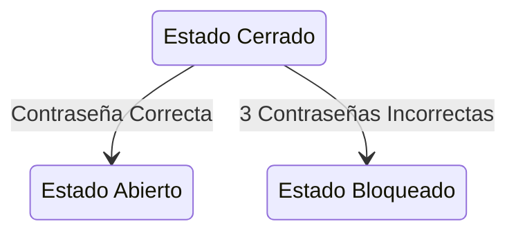

Una Mquina de estados finita consiste en un sistema el cual posee una serie de estados determinados y finitos, los cuales segun la entrada que
entre al sistema, este tomara una desciocion y cambiara de estado. EL cambio de estado se llama transcicion de estado.

## Ejemplo

Para este ejemplo maquina tendra 3 estados, cerrado, abierto y bloqueado,


En rust podriamos represnetar cada Estado como un Enum

```rs
enum State{
    Cerrado,
    Abierto,
    Bloqueado
}
```

Y la maquina como una estructura:

```rs
struct Maquina{
    estado:State,
    pin:String,
    intentos:u8
}
```

Y las fucniones asociadas con esta estructura serian:

```rs
impl Maquina{
    fn new()->Self{
        Self{
            estado:State::Cerrado,
            pin:"123".to_string(),
            intentos:0
        }
    }
    fn ingresar_pin(&mut self, pin:String){
        match self.estado{
            State::Cerrado=>{
                if pin == self.pin && self.intentos<3{
                    self.estado=abierto;
                }else{
                    self.intentos+=1;
                    if self.intentos>=3{
                        self.state=State::Bloqueado;
                    }
                }
            },
            State::Abierto=>{
                self.estado=State::Cerrado;
            },
            State::Bloqueado=>{}
        }
    }
}

```
