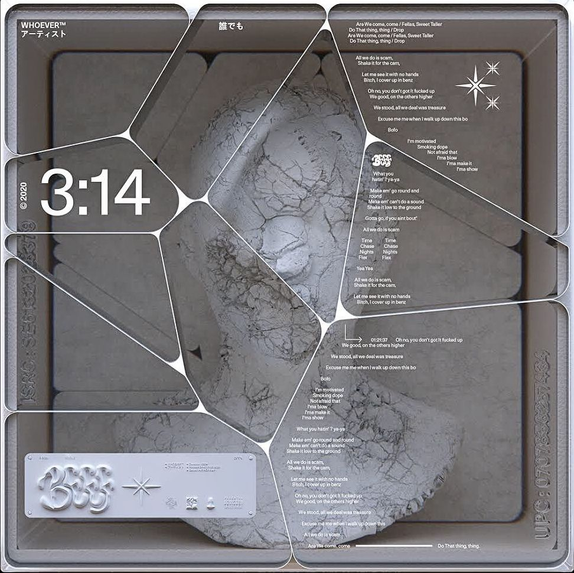
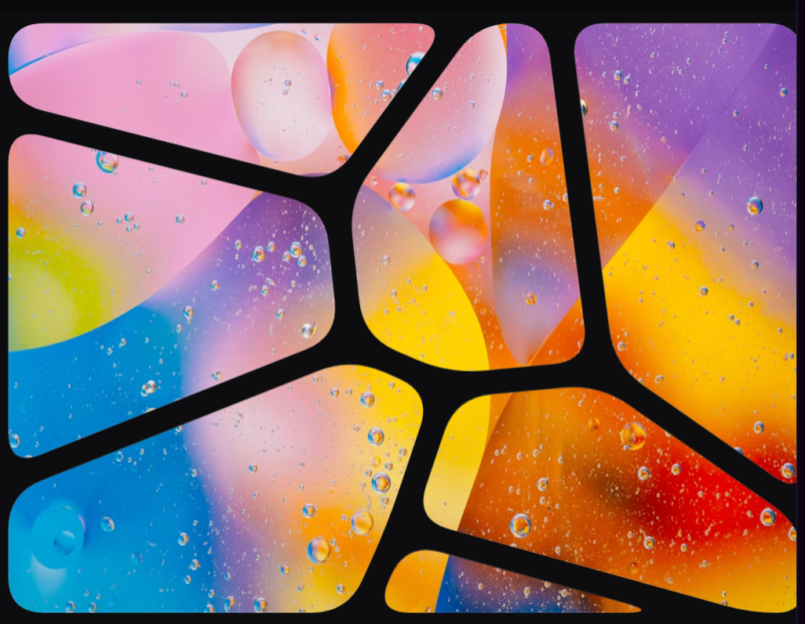

# Inspiracion

Navegando en internet me encontre con esta imagen y la quise replicar



Consiste en una serie de segmentos que parecen
celdas de voronoi, entonces nececitamos encontrar
un algoritmo que cree diagramas de voronoi
y luego llenar los elementos

# Creando un algoritmo de Voronoi

En matematicas un diagrama de Voronoi es una particion
de un plano en las regiones más cercanas dadas
un set de objetos.

# Definicion

Dada una serie de puntos $$ {\displaystyle \{p_{1},\dots, p_{n}\}}$$
en un plano Euclideano. A cada punto $$p_{k}$$ le corresponde una celda
$$R_{k}$$ que consiste en puntos en un plano Euclideano en donde
la distancia a $$p_{k}$$ es menor o igual a la ditsancia a cualquier otro
sitio $$p_{j}$$. La celda $$R_{k}$$ es la interseccion de **todos** los
espacios $$n - 1$$, las lineas entre celdas son los puntos
en los que las distancias entre dos objetos son iguales.

## Definicion formal

Sea $$X$$ un espacio métrico con una función de distancia $$d$$.
Que sea $$K$$ una serie de índices y que $$ \(P_{k}\)_{k \in K} $$ sea una
tupla de sitios en el espacio $$X$$.

Una celda de Voronoi asociada con el punto $$P_{k}$$ es el punto en el que todos los puntos en $$X$$ en los que la distancia a $$P_{k}$$ no sea mayor a la distancia con otros sitios $$P_{j}$$ donde $$j$$ es cualquier otro índice diferente a $$k$$.

En otras palabras si:
$$ d(x, A) = \inf \\{ d(x, a) \mid a \in A  \\} $$
es la distancia entre el punto *x* y el subset *A*, entonces:
$$ R_{k} = \\{ x \in X \mid d(x, P_{k}) \leq d(x, P_j) \text{ for all } j \neq k \\} $$

## Algoritmo

Primero definimos algunas clases necesarias

```ts
type Punto = {
  x: number;
  y: number;
};

type Vector = {
  u: number;
  v: number;
}

class Linea {
  p1: Punto
  vector: Vector

  constructor(p1: Punto, v1: Vector) {
    this.p1 = p1
    this.vector = v1
  }

  obtenerEcuacion(x: number, y: number): number {
    let r = this.vector.v * (x - this.p1.x) - this.vector.u * (y - this.p1.y)
    return r
  }
}
```

Luego algunas funciones de apoyo:

```ts
//Encuentra el vector perpendicular a dos puntos
function perpendicular(p1: Punto, p2: Punto): Vector {
  let val: Vector = { u: (p2.y - p1.y) * -1, v: (p2.x - p1.x) }
  return val
}

//Encuentra el punto en el que se cruzan dos lineas
//partiendo de un punto y un vector
function encontrarCruce(p1: Punto, d1: Vector, p2: Punto, d2: Vector): Punto {
  let delta = (d1.u * d2.v) - (d1.v * d2.u);

  if (delta === 0) return { x: 0, y: 0 };

  let dx = p2.x - p1.x;
  let dy = p2.y - p1.y;

  let t = (dx * d2.v - dy * d2.u) / delta;

  let x = p1.x + (t * d1.u);
  let y = p1.y + (t * d1.v);
  let p: Punto = { x: x, y: y };
  return p;
}

//Calcula el punto medio entre dos puntos
function calcularPuntoMedio(p1: Punto, p2: Punto): Punto {
  return {
    x: (p1.x + p2.x) / 2,
    y: (p1.y + p2.y) / 2
  };
}
```

Preparamos el canvas 


```ts
"use client";
import React, { useRef, useState, useEffect } from 'react';
import { Stage, Layer, Line, Rect, Image as KonvaImage } from 'react-konva';


function CanvasEraser() {
  const [lines, setLines] = useState<any[]>([]);
  const [dimensions, setDimensions] = useState({ width: 0, height: 0 });
  const [elementos, setElementos] = useState<Elemento[]>([]);
  return (
    <div className="relative w-full h-screen">
      <Stage
        width={dimensions.width}
        height={dimensions.height}
        className="absolute inset-0 z-10"
      >
        <Layer>
          <Rect
            x={0}
            y={0}
            width={dimensions.width}
            height={dimensions.height}
            fill="#333"
          />

          {imagenesZonas.map((img, i) => (
            <KonvaImage key={i} image={img} />
          ))}

          {elementos.map((el) => (
            <Line
              key={el.id}
              points={el.points}
              stroke={el.color || "black"}
              strokeWidth={el.grosor}
              lineCap="round"
              lineJoin="round"
              tension={el.tipo == 'curva' ? 0.5 : 0}
              bezier={el.tipo == 'bezier'}
              globalCompositeOperation={el.borrar ? "destination-out" : "source-over"}
            />
          ))}

        </Layer>
      </Stage>
    </div>
  );
}

export default function Mascara() {
  return <CanvasEraser />;
}
```


Agregamos unas funciones de apoyo
```ts
  useEffect(() => {
    setDimensions({ width: window.innerWidth, height: window.innerHeight });
  }, []);

  const agregarPunto = (x: number, y: number) => {
    setElementos(prev => [...prev, {
      id: Date.now() + Math.random(),
      tipo: 'linea',
      points: [x, y, x, y],
      grosor: 20,
      borrar: true
    }]);
  };

  const agregarPuntoColor = (x: number, y: number, colorHex: string) => {
    setElementos(prev => [...prev, {
      id: Date.now() + Math.random(),
      tipo: 'linea',
      points: [x, y, x, y],
      grosor: 20,
      color: colorHex,
      borrar: false
    }]);
  };

  const agregarLinea = (puntos: number[], grosor?: number, color?: string) => {
    let gr = (grosor !== undefined) ? grosor : 20;
    let brr = (color === undefined);
    setElementos(prev => [...prev, {
      id: Date.now() + Math.random(),
      tipo: 'linea',
      points: puntos,
      grosor: gr,
      color: color,
      borrar: brr
    }]);
  };

  const agregarBezier = (inicio: Punto, control: Punto, fin: Punto) => {
    setElementos(prev => [...prev, {
      id: Date.now() + Math.random(),
      tipo: 'bezier',
      points: [
        inicio.x, inicio.y,
        control.x, control.y,
        control.x, control.y,
        fin.x, fin.y
      ],
      grosor: 10,
      color: "yellow",
      borrar: false
    }]);
  };

  const agregarCurvaSuave = (puntos: number[]) => {
    setElementos(prev => [...prev, {
      id: Date.now() + Math.random(),
      tipo: 'curva',
      points: puntos,
      grosor: 30,
      borrar: true
    }]);
  };

```

Ahora el algoritmo, primero generamos
los objetos en el espacio *X*

```ts
    let lineas: Array<Punto> = [];
    let puntosMedios: Array<Punto> = [];
    let max_number = 4;
    let direcciones: Array<Vector> = [];

    const screenW = window.innerWidth || 800;
    const screenH = window.innerHeight || 600;

    for (var i = 0; i < max_number; i++) {
      let x = getRandomInt(screenW);
      let y = getRandomInt(screenH);
      let p: Punto = { x: x, y: y };
      agregarPunto(x, y);
      lineas.push(p)
    }
    lineas.push(puntos[0])
```

Luego calculamos el punto medio entre un punto y cada otro punto
en el el area *X* y calculamos la perpendicular y asignamos esa 
funcion de linea a un array de lineas que conforman la celda
de voronoi

```ts
    let listaDeCanvas: HTMLCanvasElement[] = [];
    const colores = (): string => {
      return `#${Math.floor(Math.random() * 0xFFFFFF).toString(16).padStart(6, '0')}`;
    };

    let totalPuntos = max_number;

    for (let i = 0; i < totalPuntos; i++) {
      let puntoObjetivo = lineas[i];
      let lineasDeEstaZona: Linea[] = [];

      for (let j = 0; j < totalPuntos; j++) {
        if (i === j) continue; // No compararse a sí mismo

        let vecino = lineas[j];

        let pm = calcularPuntoMedio(puntoObjetivo, vecino);

        // Calculamos la perpendicular (vector dirección de la mediatriz)
        let vectorDir = perpendicular(puntoObjetivo, vecino);

        // Creamos la línea límite y la agregamos
        lineasDeEstaZona.push(new Linea(pm, vectorDir));
      }

      let colorZona = colores()

      let canvasZona = ColorearZona(lineasDeEstaZona, puntoObjetivo, colorZona);

      listaDeCanvas.push(canvasZona);
    }
    setImagenesZonas(listaDeCanvas);
```

Y la funcion para colorear una zona es la siguiente:
```ts
  const ColorearZona = (lineas: Array<Linea>, objetivo: Punto, color: string) => {
    const width = window.innerWidth;
    const height = window.innerHeight;
    const canvas = document.createElement('canvas');
    canvas.width = width;
    canvas.height = height;
    console.log(lineas)

    const ctx = canvas.getContext('2d');
    if (!ctx) return canvas;

    ctx.fillStyle = color;

    const limiteX = width;
    const limiteY = height;
    const paso = 1;

    const signosObjetivo = lineas.map(l => {
      return l.obtenerEcuacion(objetivo.x, objetivo.y) < 0;
    });

    for (let i = 0; i < limiteX; i += paso) {
      for (let j = 0; j < limiteY; j += paso) {
        let dentro = true;
        for (let k = 0; k < lineas.length; k++) {
          const l = lineas[k];
          const debeSerNegativo = signosObjetivo[k];
          const valorPixel = l.obtenerEcuacion(i, j);
          if (debeSerNegativo) {
            if (valorPixel > 0) {
              dentro = false;
              break;
            }
          } else {
            if (valorPixel < 0) {
              dentro = false;
              break;
            }
          }
        }

        if (dentro) {
          ctx.fillRect(i, j, paso, paso);
        }
      }
    }
    return canvas;
  }

```

En la cual vamos por todo el canvas, por cada pixel y evaluamos si se debe de pintar 
el interior o el exterior de la linea dependiendo de en que ldo se encuentra el punto objetivo,
la funcion queda asi:

```ts

  const ColorearZona = (lineas: Array<Linea>, objetivo: Punto, color: string) => {
    const width = window.innerWidth;
    const height = window.innerHeight;
    const canvas = document.createElement('canvas');
    canvas.width = width;
    canvas.height = height;
    console.log(lineas)

    const ctx = canvas.getContext('2d');
    if (!ctx) return canvas;

    ctx.fillStyle = color;

    const limiteX = width;
    const limiteY = height;
    const paso = 5;

    const signosObjetivo = lineas.map(l => {
      return l.obtenerEcuacion(objetivo.x, objetivo.y) < 0;
    });

    for (let i = 0; i < limiteX; i += paso) {
      for (let j = 0; j < limiteY; j += paso) {
        let dentro = true;
        for (let k = 0; k < lineas.length; k++) {
          const l = lineas[k];
          const debeSerNegativo = signosObjetivo[k];
          const valorPixel = l.obtenerEcuacion(i, j);
          if (debeSerNegativo) {
            if (valorPixel > 0) {
              dentro = false;
              break;
            }
          } else {
            if (valorPixel < 0) {
              dentro = false;
              break;
            }
          }
        }

        if (dentro) {
          ctx.fillRect(i, j, paso, paso);
        }
      }
    }
    return canvas;
  }
```

Y asi es como podriamos hacer un diagrama de voronoi si seguimos su
definicion matematica, pero existe otro algoritmo que guarda las esquinas
y esto nos puede permitir hacer otro efecto despues.

## Segundo metodo

Este segundo metodo me sirve mejor por que almacena
los limites de cada celda en lugar de solo dibujarla
y teniendo las coordenadas puedo hacer el efecto que queria

```ts
    let lineas: Array<Punto> = [];
    let max_number = 11;

    const screenW = window.innerWidth || 800;
    const screenH = window.innerHeight || 600;

    for (var i = 0; i < max_number; i++) {
      let x = getRandomInt(screenW);
      let y = getRandomInt(screenH);
      let p: Punto = { x: x, y: y };
      agregarPunto(x, y);
      lineas.push(p)
    }

    let listaDeCanvas: HTMLCanvasElement[] = [];
    let box: Array<Punto> = [
      { x: 0, y: 0 },
      { x: screenW, y: 0 },
      { x: screenW, y: screenH },
      { x: 0, y: screenH }
    ];


    let celdasFinales: Punto[][] = [];

    for (var i = 0; i < lineas.length; i++) {
      let p = lineas[i]
      let cell = [...box]
      for (var j = 0; j < lineas.length; j++) {
        if (j == i) continue
        let q = lineas[j]
        let punto_m = calcularPuntoMedio(p, lineas[j])
        let perpen = perpendicular(p, lineas[j])
        let newCell: Punto[] = [];
        for (var k = 0; k < cell.length; k++) {
          let p1 = cell[k]
          let p2 = cell[(k + cell.length - 1) % cell.length]
          let currIn = estaMasCerca(p1, p, q);
          let prevIn = estaMasCerca(p2, p, q);
          if (currIn && prevIn) {
            newCell.push(p1);
          } else if (currIn && !prevIn) {
            let vectorBorde = { u: p1.x - p2.x, v: p1.y - p2.y };
            let interseccion = encontrarCruce(p2, vectorBorde, punto_m, perpen);
            newCell.push(interseccion);
            newCell.push(p1);
          } else if (!currIn && prevIn) {
            let vectorBorde = { u: p1.x - p2.x, v: p1.y - p2.y };
            let interseccion = encontrarCruce(p2, vectorBorde, punto_m, perpen);
            newCell.push(interseccion);
          }
        }

        if (newCell.length > 0) {
          cell = newCell;
        }
      }
      celdasFinales.push(cell);
      setPoligonosVoronoi(celdasFinales);
    }


    setImagenesZonas(listaDeCanvas);

```

Este algoritmo nos da un array de secciones, con estas secciones podemos
convertirlas en svg con la siguiente funcion:

```ts
function generarPathSuave(puntos: Punto[], radio: number): string {
  if (puntos.length < 3) return "";

  let path = "";

  for (let i = 0; i < puntos.length; i++) {
    const curr = puntos[i];
    const prev = puntos[(i - 1 + puntos.length) % puntos.length];
    const next = puntos[(i + 1) % puntos.length];

    const vPrev = { x: prev.x - curr.x, y: prev.y - curr.y };
    const vNext = { x: next.x - curr.x, y: next.y - curr.y };

    const lenPrev = Math.sqrt(vPrev.x * vPrev.x + vPrev.y * vPrev.y);
    const lenNext = Math.sqrt(vNext.x * vNext.x + vNext.y * vNext.y);

    //const radioReal = radio;
    const radioReal = Math.min(radio, lenPrev / 2, lenNext / 2);

    const startX = curr.x + (vPrev.x / lenPrev) * radioReal;
    const startY = curr.y + (vPrev.y / lenPrev) * radioReal;
    const endX = curr.x + (vNext.x / lenNext) * radioReal;
    const endY = curr.y + (vNext.y / lenNext) * radioReal;

    if (i === 0) {
      path += `M ${startX} ${startY} `;
    } else {
      path += `L ${startX} ${startY} `;
    }

    path += `Q ${curr.x} ${curr.y}, ${endX} ${endY} `;
  }

  path += "Z";
  return path;
}
```

Esta funcion convierte los puntos en un svg, lo que esta mejor para hacer los dibujos
que queremos, al finalizar y unir todo tenemos un efecto como este




### Fuentes
[Breve Introducción a los DIAGRAMAS de VORONOI](https://www.youtube.com/watch?v=qjEXwJScXyw)


[A simple algorithm for 2D Voronoi diagrams](https://www.youtube.com/watch?v=I6Fen2Ac-1U)
